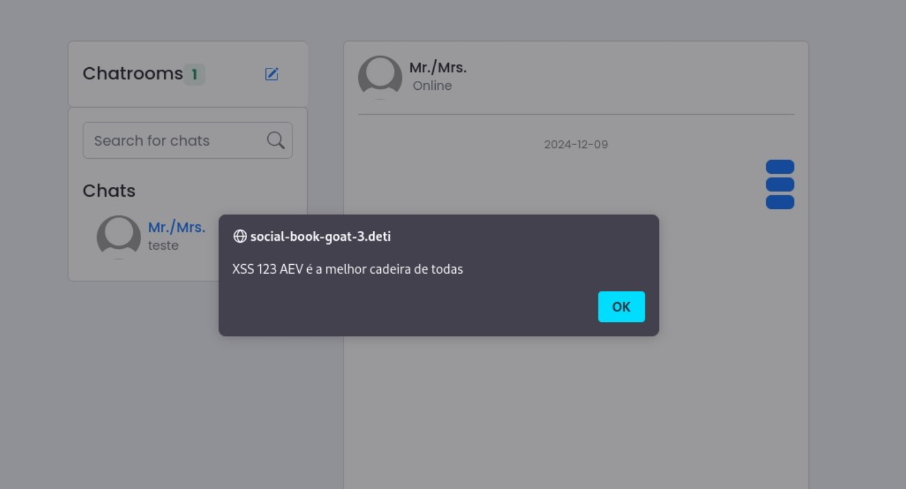

# Vulnerability: Cross-Site Scripting (XSS)
## Machine: 3

Testing Machine 3, it was found that the chat page is vulnerable to Cross-Site Scripting (XSS).

### Vulnerability Discovery

The vulnerability was identified by methodically testing all inputs for lack of proper validation and sanitization. Specifically, the message input field on the chat page was found to be vulnerable to **Stored XSS** attacks.

To demonstrate this vulnerability, we injected the following script into the input field:

```html
<script>
    alert("Teste 123 AEV é a melhor cadeira de todas!");
</script>
```

When this script is saved in the database as part of a chat message, it is executed every time the message is displayed to a user. The result is that an alert box with the specified message appears on the screen.



### Impact

While the script used in this test doesn't execute any malicious actions, this vulnerability can be exploited to:

1. Steal users sensitive information, such as credentials or session tokens.
2. Inject malicious code to compromise the application.
3. Conduct phishing attacks.

### Steps to fix the vulnerability

To fix this vulnerability, input validation and output encoding need to be performed. Here are a few suggestions for fixing the issue in a Django-based application:

1. **Input Validation:**
- Always validate and sanitize all user inputs on the server side.
Use built-in form validation in Django or library like `bleach` to strip harmful tags or attributes.

2. **Output Encoding:**
- Any user-generated content on the page is HTML-encoded, so potentially malicious scripts are stripped. Django's template engine will auto-escape variables but make sure `safe` tags are not present in the templates because they can get around that.

### Example Fix (Django)

Below there are some examples of how to prevent XSS vulnerabilities in a Django environment:

```html
<p class="card-text caption">{{post.caption <!--| safe --> }}</p>
```

```python
from django.utils.html import escape

def save_message(request):
    if request.method == 'POST':
        message = request.POST.get('message')
        sanitized_message = bleach.clean(message, strip=True)
```

Implementations of controls like the ones mentioned will enable avoiding XSS vulnerabilities and thereby secure the application.